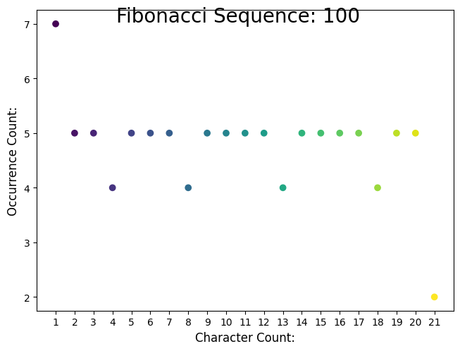
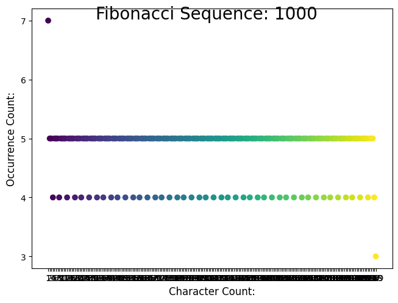
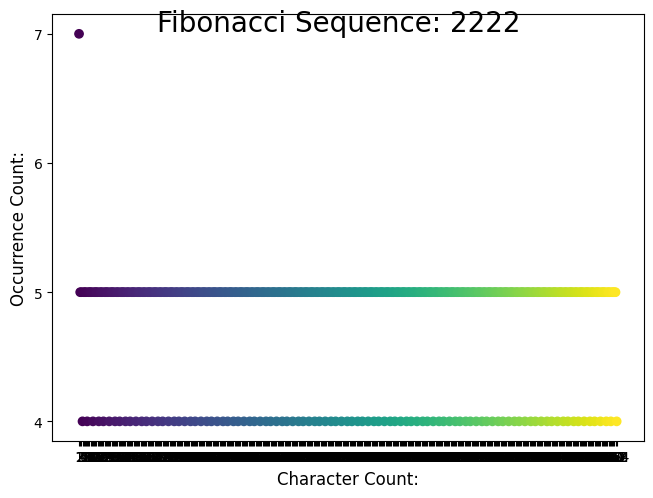

# FibonacciCharacterOccurrence
 Simple pattern check of the character length of each step in the Fibonacci sequence

# Sequence example:

Fibonacci Num:  | Len
------------- | -------------
0  | 1
1  | 1
1  | 1
2  | 1
3  | 1
5  | 1
8  | 1

**= 7 occurrences of len 1**

Fibonacci Num:  | Len
------------- | -------------
13  | 2
21  | 2
34  | 2
55  | 2
89  | 2

**= 5 occurrences of len 2**

and so on ....

